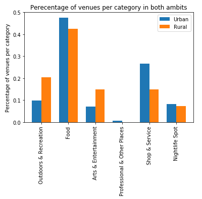
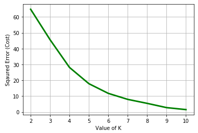
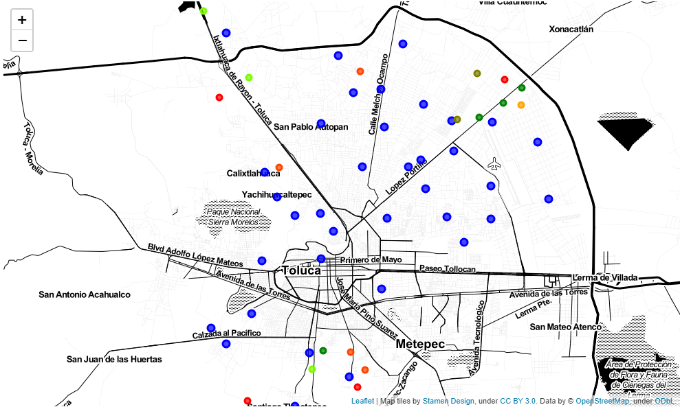

# Capstone project - Battle of the nieghborhoods Week 2
### Data science course IBM - Coursera

## Table of contents

* [Introduction](#introduction)
* [Data](#data)
* [Methodology](#methodology)
* [Analysis](#analysis)
* [Results](#results)
* [Discusion](#discusion)
* [Conclusion](#conclusion)

## Introduction 

In Mexico the census of the whole population is taken **every 10 years** (as in the US), and according to the gathered information some classifications are created based on the numbers obtained, one of those classifications is the *ambit of an area, those could be rural or urban* (depending on the population of each area).
 
Given that the census is taken every 10 years, the conditions of the population change and some areas classified as rural could be on the **verge of becoming an urban areas.**
 
*As an area transits from rural to urban the services needed differ* and knowing which areas are on this process of urbanization is helpful to service providers and government institutes in order to provide the necessary services to this areas.
 
For this project I will be using the information from Mexico. The country is divided into states, each states has municipalities and each municipality has neighborhoods. The information gathered is from the Toluca municipality, located inside the State of Mexico; one of the biggest states in Mexico in terms
of population and economic activity.
 

## Data 
In this project I will use the data available from the National Institute of Information,  Stadistics and Georaphy (*INEGI* for its initials in Spanish).
The institute provides a repository with geographic information regarding the neighborhoods of each municipality which contains the ambit (rural or urban) as well as the coordinates (latitude and londigutde) of each neighboorhood.
As requested in the project the information about venues will be consulted using Foursquare API.
Also to avoid multitude of categories used on Foursquare a process is considered to retrieve the top level category of each venue.

#### Data adquisition

Data of the location obtained

<table border="1" class="dataframe">
  <thead>
    <tr style="text-align: right;">
      <th></th>
      <th>code</th>
      <th>name</th>
      <th>ambit</th>
      <th>latitude</th>
      <th>longitude</th>
    </tr>
  </thead>
  <tbody>
    <tr>
      <th>0</th>
      <td>0001</td>
      <td>Toluca de Lerdo</td>
      <td>URBANO</td>
      <td>19.2934881</td>
      <td>-99.6573167</td>
    </tr>
    <tr>
      <th>1</th>
      <td>0043</td>
      <td>Cacalomacán</td>
      <td>URBANO</td>
      <td>19.2533094</td>
      <td>-99.7045881</td>
    </tr>
    <tr>
      <th>2</th>
      <td>0044</td>
      <td>Calixtlahuaca</td>
      <td>URBANO</td>
      <td>19.3345053</td>
      <td>-99.6854750</td>
    </tr>
    <tr>
      <th>3</th>
      <td>0046</td>
      <td>Capultitlán</td>
      <td>URBANO</td>
      <td>19.2491839</td>
      <td>-99.6630375</td>
    </tr>
    <tr>
      <th>4</th>
      <td>0049</td>
      <td>Arroyo Vista Hermosa</td>
      <td>RURAL</td>
      <td>19.3375981</td>
      <td>-99.5509325</td>
    </tr>
  </tbody>
</table>

Example of the venues adquired

<table border="1" class="dataframe">
  <thead>
    <tr style="text-align: right;">
      <th></th>
      <th>LocationCode</th>
      <th>LocationName</th>
      <th>LocationAmbit</th>
      <th>LocationLat</th>
      <th>LocationLong</th>
      <th>VenueName</th>
      <th>VenueLatitude</th>
      <th>VenueLongitude</th>
      <th>VenueCategoryID</th>
      <th>VenueCategory</th>
    </tr>
  </thead>
  <tbody>
    <tr>
      <th>0</th>
      <td>0001</td>
      <td>Toluca de Lerdo</td>
      <td>URBANO</td>
      <td>19.2934881</td>
      <td>-99.6573167</td>
      <td>Plaza de los Mártires</td>
      <td>19.292603</td>
      <td>-99.656929</td>
      <td>4bf58dd8d48988d164941735</td>
      <td>Plaza</td>
    </tr>
    <tr>
      <th>1</th>
      <td>0001</td>
      <td>Toluca de Lerdo</td>
      <td>URBANO</td>
      <td>19.2934881</td>
      <td>-99.6573167</td>
      <td>La Tradición Café Gourmet</td>
      <td>19.292747</td>
      <td>-99.658783</td>
      <td>4bf58dd8d48988d16d941735</td>
      <td>Café</td>
    </tr>
    <tr>
      <th>2</th>
      <td>0001</td>
      <td>Toluca de Lerdo</td>
      <td>URBANO</td>
      <td>19.2934881</td>
      <td>-99.6573167</td>
      <td>Museo José María Velasco</td>
      <td>19.293213</td>
      <td>-99.657874</td>
      <td>4bf58dd8d48988d18f941735</td>
      <td>Art Museum</td>
    </tr>
    <tr>
      <th>3</th>
      <td>0001</td>
      <td>Toluca de Lerdo</td>
      <td>URBANO</td>
      <td>19.2934881</td>
      <td>-99.6573167</td>
      <td>Museo De Bellas Artes Toluca</td>
      <td>19.293937</td>
      <td>-99.655868</td>
      <td>4bf58dd8d48988d18f941735</td>
      <td>Art Museum</td>
    </tr>
    <tr>
      <th>4</th>
      <td>0001</td>
      <td>Toluca de Lerdo</td>
      <td>URBANO</td>
      <td>19.2934881</td>
      <td>-99.6573167</td>
      <td>Catedral de San José de Toluca</td>
      <td>19.292013</td>
      <td>-99.657189</td>
      <td>4bf58dd8d48988d132941735</td>
      <td>Church</td>
    </tr>
  </tbody>
</table>

Example of the venues category set to the main category from the hierarchy

<table border="1" class="dataframe">
  <thead>
    <tr style="text-align: right;">
      <th></th>
      <th>LocationCode</th>
      <th>LocationName</th>
      <th>LocationAmbit</th>
      <th>LocationLat</th>
      <th>LocationLong</th>
      <th>VenueName</th>
      <th>VenueLatitude</th>
      <th>VenueLongitude</th>
      <th>VenueCategoryID</th>
      <th>VenueCategory</th>
    </tr>
  </thead>
  <tbody>
    <tr>
      <th>0</th>
      <td>0001</td>
      <td>Toluca de Lerdo</td>
      <td>URBANO</td>
      <td>19.2934881</td>
      <td>-99.6573167</td>
      <td>Plaza de los Mártires</td>
      <td>19.292603</td>
      <td>-99.656929</td>
      <td>4d4b7105d754a06377d81259</td>
      <td>Outdoors &amp; Recreation</td>
    </tr>
    <tr>
      <th>1</th>
      <td>0001</td>
      <td>Toluca de Lerdo</td>
      <td>URBANO</td>
      <td>19.2934881</td>
      <td>-99.6573167</td>
      <td>La Tradición Café Gourmet</td>
      <td>19.292747</td>
      <td>-99.658783</td>
      <td>4d4b7105d754a06374d81259</td>
      <td>Food</td>
    </tr>
    <tr>
      <th>2</th>
      <td>0001</td>
      <td>Toluca de Lerdo</td>
      <td>URBANO</td>
      <td>19.2934881</td>
      <td>-99.6573167</td>
      <td>Museo José María Velasco</td>
      <td>19.293213</td>
      <td>-99.657874</td>
      <td>4d4b7104d754a06370d81259</td>
      <td>Arts &amp; Entertainment</td>
    </tr>
    <tr>
      <th>3</th>
      <td>0001</td>
      <td>Toluca de Lerdo</td>
      <td>URBANO</td>
      <td>19.2934881</td>
      <td>-99.6573167</td>
      <td>Museo De Bellas Artes Toluca</td>
      <td>19.293937</td>
      <td>-99.655868</td>
      <td>4d4b7104d754a06370d81259</td>
      <td>Arts &amp; Entertainment</td>
    </tr>
    <tr>
      <th>4</th>
      <td>0001</td>
      <td>Toluca de Lerdo</td>
      <td>URBANO</td>
      <td>19.2934881</td>
      <td>-99.6573167</td>
      <td>Catedral de San José de Toluca</td>
      <td>19.292013</td>
      <td>-99.657189</td>
      <td>4d4b7105d754a06375d81259</td>
      <td>Professional &amp; Other Places</td>
    </tr>
  </tbody>
</table>

## Methodology 
In the project we will review two methods to predict which neighborhoods are in the process of urbanization:
1. Logistic regresion (supervised method)
2. Clustering (unsupervised method

#### Logistic regresion
    This method is used to predict a categorical value (rural or urban) with a diven set of independent data

#### K-Means
    For this we will use K-Means for clustering rural neighborhoods given the quantity of venues around them

## Analysis 
As initial exploration of the data adquired, let's see a bar chart of the percentage of venues per category from both ambits

As we can appreciate on the bar chart there is not big difference on the percentages of venues per category among both ambits.
This could lead to a low accuracy on the prediction model.

##### Results of the logistic regresion model to find if a neighborhood is rural or urban

    Results liblinear solver
    Jaccard score  0.5
                  precision    recall  f1-score   support
    
               0       0.38      0.75      0.50         4
               1       0.86      0.55      0.67        11
    
        accuracy                           0.60        15
       macro avg       0.62      0.65      0.58        15
    weighted avg       0.73      0.60      0.62        15
    

As we can see on the classification report the accuracy of the logistic regresion is low, <70%
Therefore this method is not the best given the information of the Tolca municipaly; maybe with other municipality this method could provide a more accurate prediction

Now I proceed to use K-Means algorith to find insight from the rural neighboorhoods

First we need to find the best value of K, through iteration of this model we obtained the following graphic showing the best value of K

Using the elbow method we can see that the best K for the algorith is 6

We see a summary per cluster in order to interpret the results of k-Means

|Cluster|Color in map|Interpretation|
|-|-|-|
|4|red|Neighborhood mostly urbanized|
|1|orangered|Neighborhood almost urbanized|
|3|orange|Neighborhood almost being urbanized|
|5|olive|Neighborhood less urbanized|
|0|green|Neighborhood to be urbanized|
|2|lime|Neighborhood poorly urbanized|

## Results 

#### Logistic regresion model
As seen by the Jaccard score and accuracy in classification report the data set is not the most appropriate to predict if a given neighboorhood is rural or urban according to the summary of venues, this could be originated in the fact that Toluca municipality is almost urban and the difference between these two ambits is no longer that evident.

#### K-Means
Using the clustering of K-Means we can see that despite the fact that almost all the municipality is becoming urbanized, there are neighboorhoods which are ahead of this process.
As we can see the first three clusters (from red to orange) are located near the airport and also have been an increase of industrial parks created in that zone.
In the other hand we can see in clusters 3-6 (from olive to lime) the venues are more related to recreation and shops and this concurs the real state developments around that zone of the municipality of Metepec.

## Discusion 
Finding which neighborhoods are going trough a process of urbanization is an important task due to the different services a community needs.
Unfortunately the first approach was not highly accurate given the situation of the municipality studied; however I believe this could be achieved with a different set of data in which the difference of these two ambits is more broad.
This step back on a prediction algorithm allow me to explore other methods; and using an automatic clustering I was able to find some insights of this neighborhoods and how are they changing.
Luckily this work is being done in year 2020 and the census result can be expected soon in order to validate the methods and findings of this work.

## Conclusion 
The results of this excercise could be useful to service providers such as mobile conections, broadband and electricity just to name a few particular providers. 
These results could be useful to government agencies on the three levels (municipality, state and federal) as the changes in the population lead to the need of new roads, increase of police force and water supply as some examples.
